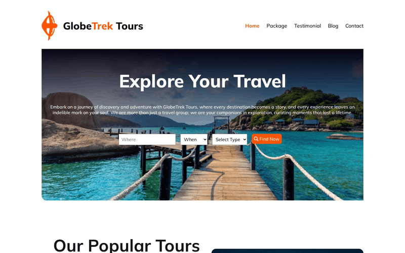
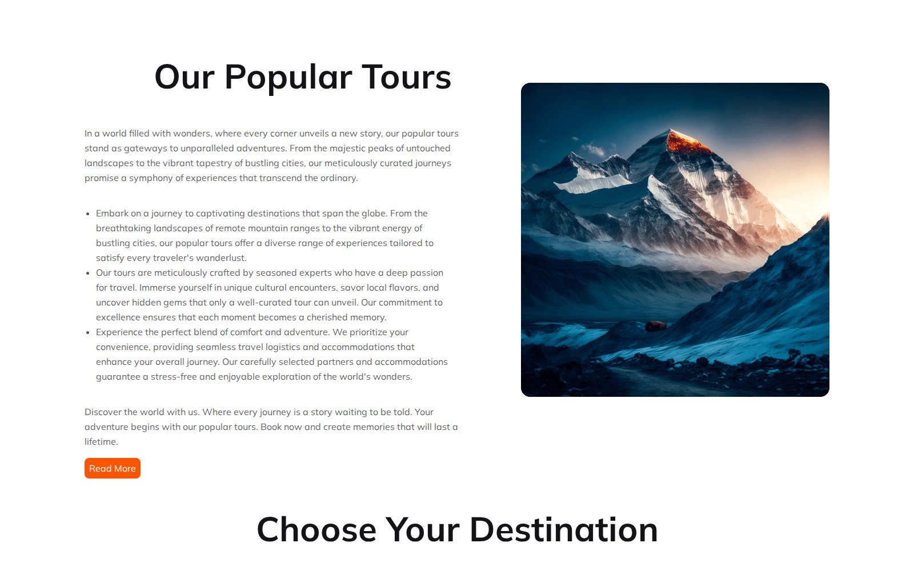
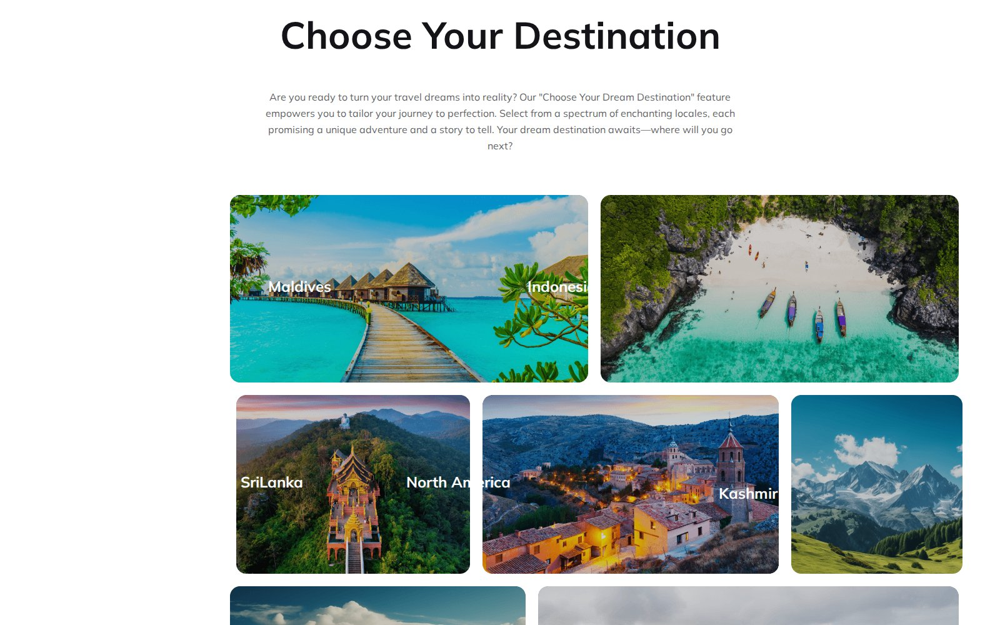
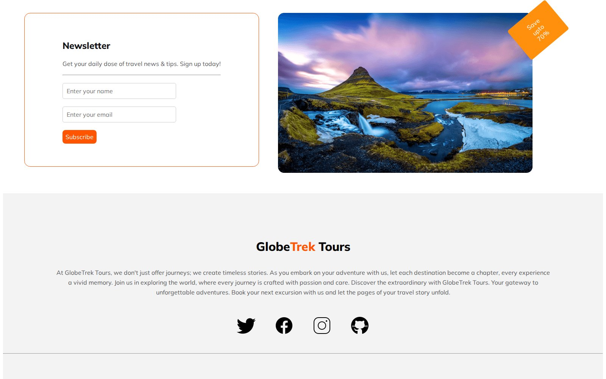

# GlobeTrek Tours

A travel agency landing page built with plain HTML and CSS: trip search, popular tours, a destination gallery and a newsletter sign-up.

**Live site:** <https://shayan-abrar.github.io/GlobeTrek-Tours/>

<p align="center">
  
</p>

<table>
  <tr>
    <td align="center" width="25%"><a href="screenshots/preview.jpg"></a><br><sub><b>Hero</b> · trip search</sub></td>
    <td align="center" width="25%"><a href="screenshots/popular-tours.jpg"></a><br><sub><b>Popular tours</b></sub></td>
    <td align="center" width="25%"><a href="screenshots/destinations.jpg"></a><br><sub><b>Destinations</b></sub></td>
    <td align="center" width="25%"><a href="screenshots/newsletter.jpg"></a><br><sub><b>Newsletter</b> · footer</sub></td>
  </tr>
</table>

A travel agency's homepage has to inspire people and then point them to a next step, whether that's a search, a tour or a sign-up. This page covers that path in one scroll with only HTML and one stylesheet, so each section's layout (Flexbox rows, an image gallery, a card grid and a form) is easy to study on its own.

## Quick Start

```bash
git clone https://github.com/SHAYAN-ABRAR/GlobeTrek-Tours.git
cd GlobeTrek-Tours
python3 -m http.server 8000
```

Open <http://localhost:8000>. On Windows, use `python` instead of `python3`. Opening `index.html` directly in a browser works too. Font Awesome, the Mulish font and the embedded YouTube video load from the internet.

## Features

- **Hero with trip search:** a "Where" field, **When** and **Select Type** (solo or family) dropdowns and a **Find Now** button over a full-width photo.
- **Our Popular Tours:** a text column with highlights and a **Read More** button beside a mountain photo.
- **Choose Your Destination:** a photo gallery labeled Maldives, Indonesia, Sri Lanka, North America, Kashmir, Bangladesh and Bandarban.
- **Why Choose Us:** cards for handpicked hotels, world-class service and a best-price guarantee.
- **A Simple Perfect Place To Get Lost:** feature copy next to an embedded YouTube video.
- **Newsletter:** name and email fields with a "Save up to 70%" tag on the photo beside them.
- **Compact header on phones:** below 600px the navigation links are hidden, a hamburger icon appears and the search fields stack.

## Customizing

The page's orange accent is applied inline in `index.html` (`color: #FF5400`) for the "Trek" part of the logo and the active nav link. The phone breakpoint is the `@media screen and (max-width: 600px)` block at the end of `style.css`, which is where the header changes:

```css
@media screen and (max-width: 600px) {
    .navR {
        display: none;
    }

    .nav-toggle {
        display: block;
    }
}
```

## Limitations

- The layout is sized for wide screens. On windows narrower than about 1,540px the destination gallery is wider than the page, so a horizontal scrollbar appears, and phones scroll sideways too.
- The hamburger icon doesn't open a menu, and the search, **Read More**, **See More** and **Subscribe** buttons aren't connected to anything.
- The "Why Choose Us" introduction renders as a very narrow column, and the destination labels are positioned absolutely, so some of them overlap the edges of their photos.

## Tech Stack

- HTML5
- CSS3 (Flexbox and a media query) in `style.css`
- Font Awesome 6.5.1 (search icon) and Google Fonts: Mulish
- Hosted on GitHub Pages

## Contributing

Suggestions and bug reports are welcome. Please [open an issue](https://github.com/SHAYAN-ABRAR/GlobeTrek-Tours/issues). Please read the license note below before reusing any code or images.

## License

This repository doesn't have a license yet, so it doesn't grant anyone permission to reuse or redistribute its code or images. Please ask before reusing any part of it. The hotel, service, price, menu and social icons are from [Icons8](https://icons8.com).

---

Built by **Shayan Abrar** · [GitHub](https://github.com/SHAYAN-ABRAR) · [LinkedIn](https://www.linkedin.com/in/shayan-abrar/)
