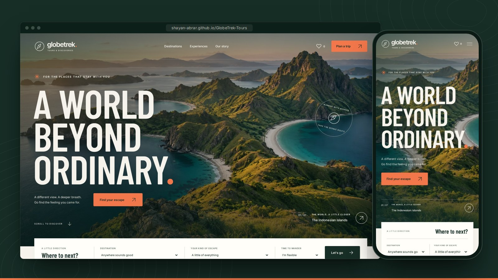
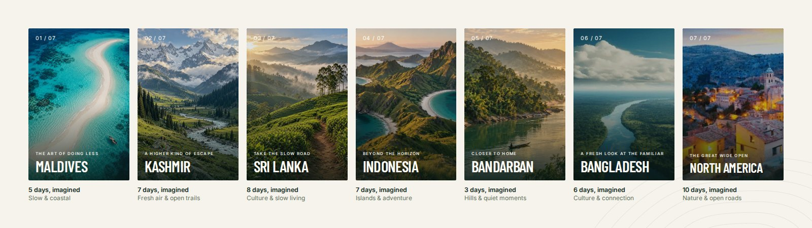
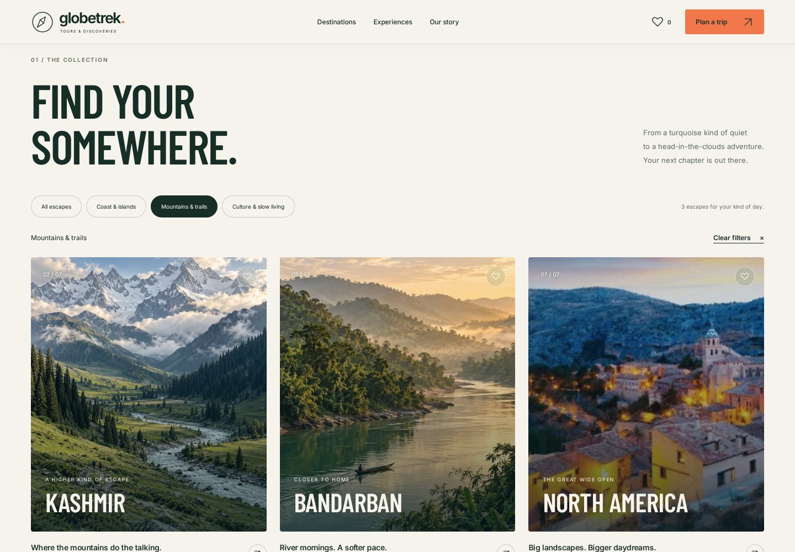
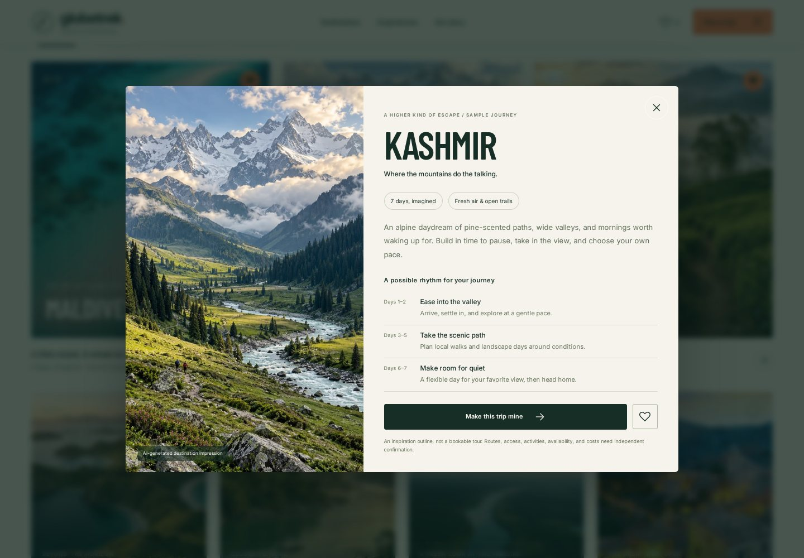
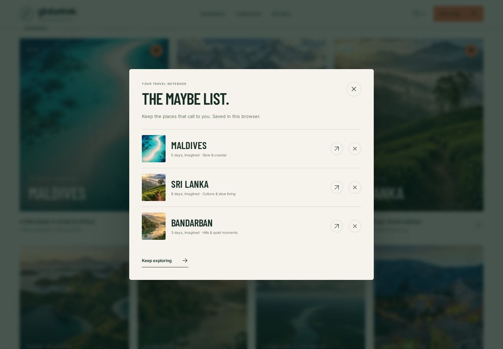
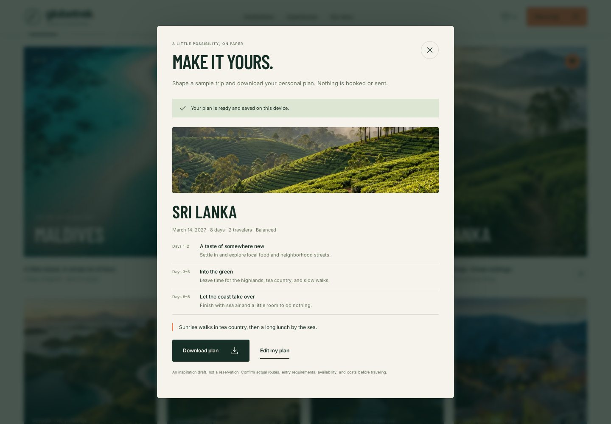
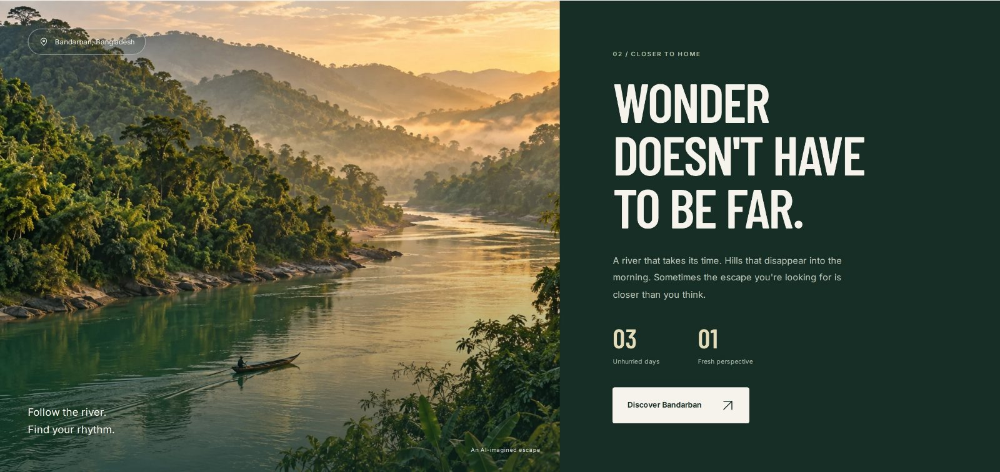
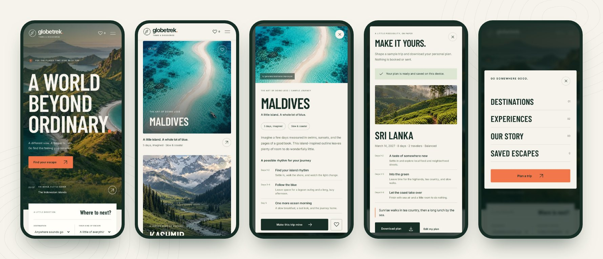
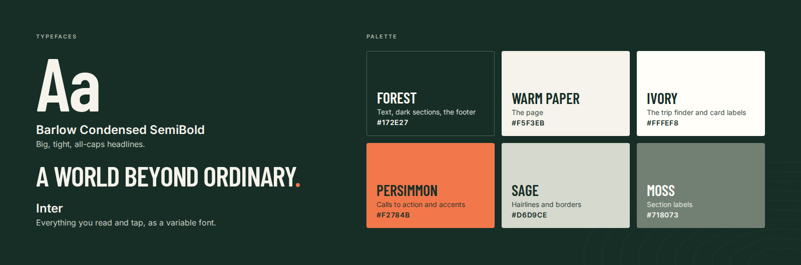
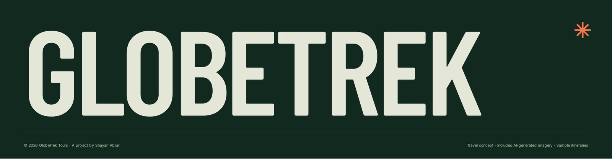

<p align="center">
  <a href="https://shayan-abrar.github.io/GlobeTrek-Tours/">
    
  </a>
</p>

<h1 align="center">GlobeTrek Tours</h1>

<p align="center">
  <b>A world beyond ordinary.</b> A cinematic travel-inspiration site: seven destinations to wander through,<br>
  a sample journey for each one, and a trip notebook that stays in your browser.
</p>

<p align="center">
  <a href="https://shayan-abrar.github.io/GlobeTrek-Tours/"><b>Visit the live site</b></a>
  &nbsp;·&nbsp; <a href="#the-collection">The collection</a>
  &nbsp;·&nbsp; <a href="#a-closer-look">A closer look</a>
  &nbsp;·&nbsp; <a href="#features">Features</a>
  &nbsp;·&nbsp; <a href="#design">Design</a>
  &nbsp;·&nbsp; <a href="#run-it-locally">Run it locally</a>
</p>

<p align="center">
  
  
  
  
  
</p>

---

GlobeTrek reads like a travel magazine you can open. It starts on a full-bleed island view, then moves through a collection of seven places, a quiet story about Bandarban, three moods to travel by, and a short manifesto about slower travel. Choose a place and it opens as a sample journey. Tap a heart and it goes into your notebook. Shape a trip, and you can download it as a plan of your own.

It's plain HTML, CSS and JavaScript, with no framework, nothing to install and no build step. You can even open `index.html` straight from your computer.

> [!NOTE]
> GlobeTrek is a travel-inspiration project, not a booking service. The itineraries are sample outlines, there are no prices, availability, payments or reservations, and nothing you type is sent anywhere. Five of the destination images are AI-generated impressions, and the site labels them that way.

## The collection

<p align="center">
  
</p>

| | Destination | In a line | Sample journey |
| :-: | --- | --- | --- |
| 01 | **Maldives** | *A little island. A whole lot of blue.* | 5 days · Slow & coastal |
| 02 | **Kashmir** | *Where the mountains do the talking.* | 7 days · Fresh air & open trails |
| 03 | **Sri Lanka** | *Tea-country mornings. Ocean endings.* | 8 days · Culture & slow living |
| 04 | **Indonesia** | *More islands. More possibilities.* | 7 days · Islands & adventure |
| 05 | **Bandarban** | *River mornings. A softer pace.* | 3 days · Hills & quiet moments |
| 06 | **Bangladesh** | *Small discoveries. Lasting stories.* | 6 days · Culture & connection |
| 07 | **North America** | *Big landscapes. Bigger daydreams.* | 10 days · Nature & open roads |

<sub>The images for Maldives, Kashmir, Sri Lanka, Indonesia and Bandarban are AI-generated impressions made for the redesign. Bangladesh and North America use photos from the original 2024 version of the site.</sub>

## A closer look

<table>
  <tr>
    <td width="50%" valign="top">
      <a href="screenshots/collection.jpg"></a>
      <br><sub><b>Find your somewhere</b> · filter by the kind of escape you want</sub>
    </td>
    <td width="50%" valign="top">
      <a href="screenshots/itinerary.jpg"></a>
      <br><sub><b>A sample journey</b> · every destination opens its own itinerary</sub>
    </td>
  </tr>
  <tr>
    <td width="50%" valign="top">
      <a href="screenshots/notebook.jpg"></a>
      <br><sub><b>The maybe list</b> · the places you've hearted, kept in your browser</sub>
    </td>
    <td width="50%" valign="top">
      <a href="screenshots/planner.jpg"></a>
      <br><sub><b>Make it yours</b> · a trip plan you can download or print</sub>
    </td>
  </tr>
</table>

<p align="center">
  <a href="screenshots/closer-to-home.jpg"></a>
  <br><sub><b>Closer to home</b> · a cinematic section for Bandarban, Bangladesh</sub>
</p>

<p align="center">
  <a href="screenshots/mobile.jpg"></a>
  <br><sub>On phones, the trip finder stacks under the hero, the menu opens as a panel, and every itinerary and plan fits the screen.</sub>
</p>

## Features

### 01 · Find your somewhere

- **Trip finder.** Pick a destination, your kind of escape and the time you have (up to 4 days, 5–7 days or 8+), then **Let's go**. The collection shows what matches, with a summary such as *Kashmir · Mountains & trails · 5–7 days* and a **Clear filters** link.
- **Filter chips** for Coast & islands, Mountains & trails and Culture & slow living, and three **experience cards** (*Salt in the air*, *Head in the clouds*, *Time to take it in*) that do the same from further down the page.
- The collection opens with three places and **Explore all 7 destinations** shows the rest. When nothing matches, a friendly empty state offers **Show all destinations**.

### 02 · A sample journey for every place

- Each destination opens an itinerary with its image, tagline, length and mood, a short description and a three-part *possible rhythm* for the trip.
- The image is labelled either *AI-generated destination impression* or *From the original GlobeTrek collection*.
- **Make this trip mine** opens the trip planner with that destination already chosen.

### 03 · The maybe list

- Tap the heart on any card or itinerary to save a place. The count in the header updates, and the notebook lists everything you've saved, ready to open or remove.
- Saved places are kept in your browser's `localStorage` under `globetrek-saved-v1`, so they're still there next time.
- If the browser blocks storage, saving still works for the visit, and the site says so.

### 04 · Make it yours

- Choose a destination, a possible departure date (past dates aren't accepted), how many are coming (one to six), a pace (*Unhurried*, *Balanced* or *Adventurous*) and a note to your future self of up to 500 characters.
- The plan appears with the full route and your note. The last plan is kept on your device under `globetrek-plan-v1`, so you can come back and edit it.
- **Download plan** saves it as a text file, such as `GlobeTrek-sri-lanka-Trip-Plan.txt`. Printing while the plan is open prints just the plan.

<details>
<summary><b>What a downloaded plan looks like</b></summary>

```text
GLOBETREK — YOUR SRI LANKA TRIP NOTEBOOK

Tea-country mornings. Ocean endings.
Departure: March 14, 2027
Duration: 8 days (sample outline)
Travelers: 2
Pace: Balanced

A POSSIBLE RHYTHM
Days 1–2 — A taste of somewhere new
Settle in and explore local food and neighborhood streets.

Days 3–5 — Into the green
Leave time for the highlands, tea country, and slow walks.

Days 6–8 — Let the coast take over
Finish with sea air and a little room to do nothing.

NOTE TO MY FUTURE SELF
Sunrise walks in tea country, then a long lunch by the sea.

This is a personal inspiration draft, not a booking or a confirmed itinerary.
No details have been sent to an agency. Confirm actual routes, access, entry requirements, activities, availability, and costs independently before traveling.

GlobeTrek Tours — A project by Shayan Abrar
```

</details>

### 05 · Press play

- The travel film from the original version of the site plays in a dialog. Nothing loads from YouTube until you press play, it uses YouTube's privacy-enhanced embed, and it's removed when you close the dialog. There's also a link to watch it on YouTube.

### Made for everyone

- A skip link, a clear heading order and a visible focus ring on every control.
- Itineraries, the notebook, the planner, the film and the phone menu are native dialogs: focus stays inside while they're open, Escape or a click outside closes them, and focus goes back to where you were.
- Saving, removing and downloading are confirmed in a status message that screen readers announce, and the filter chips and hearts report whether they're on.
- Images are described for screen readers, and the descriptions of the AI-generated ones say so.
- Animations and smooth scrolling switch off when your system asks for reduced motion.
- Works from 320 px wide phones to wide desktops.
- Images are responsive WebP files, and those further down the page load lazily. The fonts and icons are in the repository, so the page doesn't call any other site until you choose to play the film.

## Design

The art direction is a cinematic travel magazine: full-bleed landscapes, big condensed headlines, warm paper, deep forest green and a single persimmon accent.

<p align="center">
  
</p>

- **Typefaces:** Barlow Condensed SemiBold for headlines and Inter for everything else, both self-hosted.
- **Color:** the palette and the two font stacks are custom properties at the top of `style.css`.
- **Icons:** a small inline SVG set in `index.html`: compass, heart, arrows, waves, mountain, sun, pin and more.
- **Imagery:** five AI-generated destination impressions and two photos from the original site, exported as responsive WebP. The prompts and the source of every image are in [`assets/images/README.md`](assets/images/README.md).
- **Motion:** a slow arrival for the hero image, gentle reveals for the cards and small hover movements, all switched off for reduced motion.

## Run it locally

There's nothing to install. Open `index.html` in a modern browser and it works, no server needed.

To serve it the way GitHub Pages does, use any static server:

```bash
git clone https://github.com/SHAYAN-ABRAR/GlobeTrek-Tours.git
cd GlobeTrek-Tours
python3 -m http.server 8000
```

Open <http://localhost:8000>. On Windows, use `python` instead of `python3`. To preview it under the same `/GlobeTrek-Tours/` path as the live site, run the server from the folder that contains the project and open <http://localhost:8000/GlobeTrek-Tours/>.

## Project structure

```text
index.html               The page: sections, dialogs, the SVG icon set and link-preview tags
style.css                Colors, type, layout, responsive rules, motion, dialogs and print
script.js                The destinations, filters, saved places, itineraries, planner and film
assets/images/           Responsive WebP images, with their notes and prompts in README.md
assets/fonts/            Barlow Condensed and Inter, with their licenses
assets/favicon.svg       The compass mark
docs/VERIFICATION.md     The browser checks run for the redesign
docs/ORIGINAL-README.md  The README of the 2024 version
Images/                  Images and Icons8 icons from the 2024 version, no longer used by the page
screenshots/             Images for this README, and screenshots of earlier versions
.nojekyll                Tells GitHub Pages to publish the files as they are
```

### Changing a destination

Each destination is one entry in the `trips` array at the top of `script.js`: its name, mood, length, images, description and three-part route. Edit an entry and its card, filters, itinerary, notebook entry, plan and downloaded file all follow. The two destination menus in `index.html` (the trip finder and the planner) list the names separately.

To add a destination:

1. Add a portrait image 900 pixels wide and a 480-pixel-wide copy to `assets/images/`, and an entry to `trips` that points to them.
2. Add it to both destination menus in `index.html`.
3. Update the places that say there are seven: `7 places`, `Explore all 7 destinations`, `01 / 07` and the `<noscript>` list in `index.html`, and `/ 07` and `of 7` in `script.js`.

Notes typed into the planner are always shown as plain text, never as HTML.

## From the first version

GlobeTrek began in January 2024 as a static landing page for a travel agency: a search bar, popular tours, a destination gallery, a *Why choose us* section, a travel film and a newsletter form. The October 2026 redesign keeps its seven destinations, its orange accent, its travel film and its creator links, and turns the page into something you can use:

- the search and the phone menu now work, where they used to do nothing, and every destination opens a sample journey
- the layout fits phones, where the old gallery made pages scroll sideways
- the inactive newsletter form is replaced by the trip notebook and planner
- Font Awesome and Google Fonts are replaced by self-hosted fonts and inline icons

The README of the first version is kept in [`docs/ORIGINAL-README.md`](docs/ORIGINAL-README.md), and its screenshots are still in `screenshots/`.

## Tech stack

- HTML, CSS and JavaScript, with no framework, dependencies or build step
- Native `<dialog>` elements and `localStorage`
- Responsive WebP images and inline SVG icons
- Barlow Condensed and Inter, self-hosted
- Hosted on GitHub Pages

## Credits

- **Typefaces:** Barlow Condensed, Copyright 2017 The Barlow Project Authors, and Inter, Copyright 2016 The Inter Project Authors, both under the SIL Open Font License 1.1. The license files are in `assets/fonts/`.
- **Imagery:** five AI-generated destination impressions made for the redesign, with their prompts in [`assets/images/README.md`](assets/images/README.md). The Bangladesh and North America photos come from the original version of the site, and their sources aren't recorded in the repository.
- **Travel film:** a YouTube video the original site embedded. It plays from YouTube.
- **Legacy icons:** the hotel, service, price, menu and social icons in `Images/` are from [Icons8](https://icons8.com).

## Contributing

Suggestions and bug reports are welcome. Please [open an issue](https://github.com/SHAYAN-ABRAR/GlobeTrek-Tours/issues). Please read the license note below before reusing any code or images.

## License

This repository doesn't have a license yet, so it doesn't grant anyone permission to reuse or redistribute its code or images. Please ask before reusing any part of it. The hotel, service, price, menu and social icons are from [Icons8](https://icons8.com).

<p align="center">
  <a href="https://shayan-abrar.github.io/GlobeTrek-Tours/"></a>
</p>

---

Built by **Shayan Abrar** · [GitHub](https://github.com/SHAYAN-ABRAR) · [LinkedIn](https://www.linkedin.com/in/shayan-abrar/)
