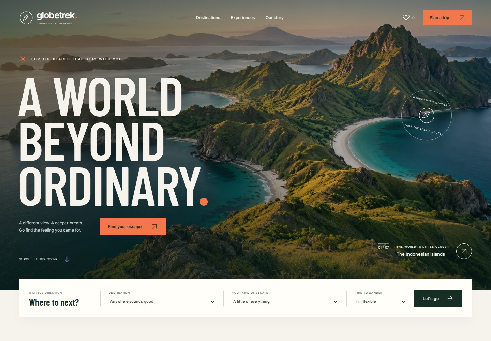

# GlobeTrek Tours — A world beyond ordinary

A cinematic travel discovery concept by **Shayan Abrar**. Built with plain HTML, CSS, and JavaScript, with five original AI-generated destination images, self-hosted fonts, and a working personal trip notebook.

**Project:** <https://github.com/SHAYAN-ABRAR/GlobeTrek-Tours>
**GitHub Pages address:** <https://shayan-abrar.github.io/GlobeTrek-Tours/>



## Preview locally

Open `index.html` directly in a modern browser. No installation or build step is needed.

Alternatively, run this from the project folder:

```powershell
python -m http.server 8000
```

Then visit <http://localhost:8000>. On macOS or Linux, use `python3` if needed.

## What works

- A responsive cinematic homepage, mobile navigation, keyboard focus indicators, and reduced-motion support.
- Seven destinations retained from the original project: Maldives, Indonesia, Sri Lanka, North America, Kashmir, Bangladesh, and Bandarban.
- Combined search by destination, experience, and trip length; empty results with a clear reset.
- Experience cards that filter the destination collection.
- Individual itinerary dialogs with three-part sample journey outlines.
- Saved destinations that persist locally in the same browser; a usable session-only fallback if storage is blocked.
- A personal trip planner with destination, optional future departure date, party size, pace, and notes.
- A downloadable UTF-8 text trip notebook and a locally saved draft.
- The original YouTube film, loaded only after the visitor chooses to play it, with an external link fallback.

## Scope

This is a **travel inspiration portfolio project**, not a connected booking service. The itinerary outlines and durations are illustrative. No live availability, prices, payments, reservations, email subscriptions, or agency contact submissions are implemented. The trip planner does not transmit user data. Saved trips and the last plan stay in the current browser's local storage.

The original inactive newsletter form has been replaced by the useful trip notebook flow. The original destinations, orange brand accent, travel film, creator links, and original image files are retained. Original screenshots remain as historical reference; images prefixed `redesign-` show the new version.

## Design and assets

- Forest green, warm paper, and persimmon orange.
- Barlow Condensed for expressive display type; Inter for the interface.
- Five custom AI-generated destination impressions: Indonesian islands, Maldives, Kashmir, Sri Lanka, and Bandarban. They illustrate a mood rather than document an exact location or tour.
- Responsive WebP image exports and self-hosted fonts. No runtime font, icon, or JavaScript CDN.
- Two additional collection images optimized from the original repository, for Bangladesh and North America.
- Exact AI prompts and image provenance: [`assets/images/README.md`](assets/images/README.md).
- Font licenses: `assets/fonts/OFL-Barlow-Condensed.txt` and `assets/fonts/OFL-Inter.txt`.

## Edit the site

- `index.html`: page sections, semantic structure, dialog shells, metadata, footer links.
- `style.css`: colors, typography, layout, responsive rules, motion, and dialog styling.
- `script.js`: the `trips` array, filtering, saved destinations, dialogs, and the planner.
- `assets/images/`: all optimized imagery used by the redesign.
- `assets/favicon.svg`: the custom compass mark.

To change an itinerary, edit its entry in the `trips` array in `script.js`. To add a new destination, also add it to the two destination selects in `index.html` and update the collection counts. User notes are inserted with `textContent`, never interpreted as HTML.

## GitHub Pages

This is a static site with relative asset paths and no build step. After merging the redesign into `main`, configure **Settings → Pages → Deploy from a branch → main → /(root)** if branch publishing is not already enabled. Save the setting, then check the Pages deployment in the Actions tab before refreshing the live URL.

Official publishing-source instructions: <https://docs.github.com/en/pages/getting-started-with-github-pages/configuring-a-publishing-source-for-your-github-pages-site>

The included `.nojekyll` file allows direct static-file publishing. This package does not change repository settings itself.

## Validation

See [`docs/VERIFICATION.md`](docs/VERIFICATION.md) for the tested flows and limits. Desktop and phone screenshots are in `screenshots/`.

## Ownership and credits

Built by **Shayan Abrar** · [GitHub](https://github.com/SHAYAN-ABRAR) · [LinkedIn](https://www.linkedin.com/in/shayan-abrar/)

This repository has no project license; this redesign does not add one or change ownership. Fonts retain their included SIL Open Font Licenses. Legacy icons in `Images/` are from [Icons8](https://icons8.com), as credited in the original README; the new interface uses local SVG icons. The previous README is preserved in [`docs/ORIGINAL-README.md`](docs/ORIGINAL-README.md).
